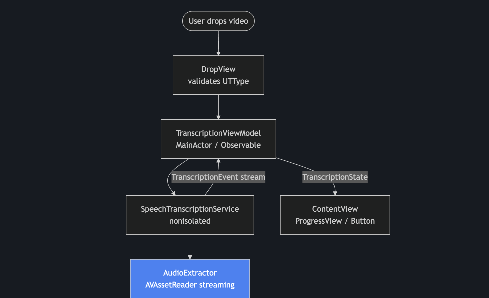
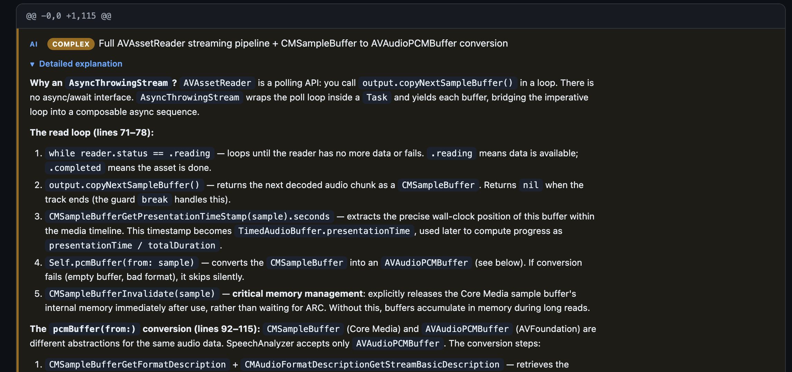
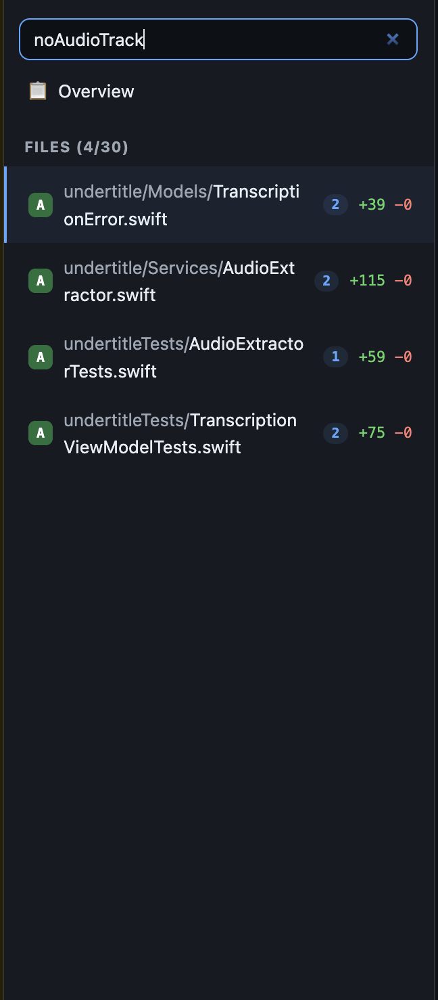
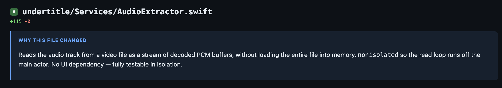
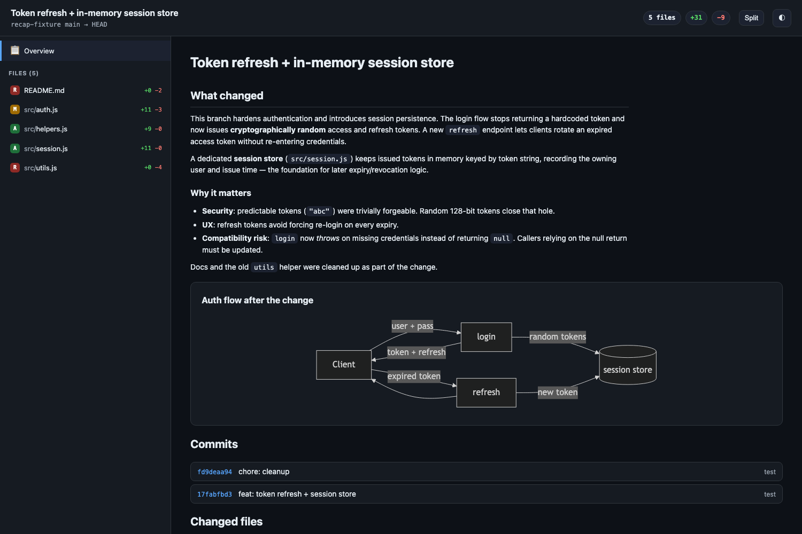

# 📊 diff-recap

**Understand any code change at a glance — fully offline.**

`diff-recap` turns a git diff into one self-contained, interactive `recap.html`:
architecture diagrams, side-by-side diffs, and AI explanations of *why* the code
changed. No external service, no server, no sign-in — just open the file in your
browser. Even on a plane. ✈️

> 💡 **Heads up:** it reads a **git diff**, so your changes need to be tracked by
> git (committed, or staged/modified on already-tracked files). Brand-new files
> you have never `git add`ed won't show up — stage them first.

---

## ✨ What you get

### 1. 🗺️ Diagrams that explain the change

Each recap includes a Mermaid diagram of the architecture or data flow, so you
grasp the shape of the change *before* reading a single line.



### 2. 🧠 AI explanations for the tricky parts

Hard-to-follow code gets a **Complex** badge and an expandable, step-by-step
walkthrough — so dense logic stops being a wall of text.



### 3. 🔍 Search across files and code

Type a keyword and the sidebar instantly filters files by path **and** by diff
content, showing how many matches each file has.



### 4. 📝 A plain-English summary per file

Every changed file tells you what it does and why it changed — no guessing.



### …and the rest

A full overview (summary + diagram + commits + file grid), word-level diff
highlighting, split/unified toggle, light/dark theme, English & Spanish UI, and
shareable deep links (`recap.html#file/2`).



---

## 🚀 Install (30 seconds)

It's a Claude Code (and compatible) Agent Skill — no `npm install`, no build.

```bash
# available everywhere
git clone git@github.com:cocodrino/diff-recap.git ~/.claude/skills/diff-recap
```

Restart your agent, then run `/diff-recap` inside any git repo. It asks which
model to use, then builds the recap for you.

Prefer it scoped to one project? Clone into `.claude/skills/diff-recap` instead.

---

## 🤔 Why diff-recap?

Most diff viewers either need a server, a hosted account, or send your code
somewhere else to render it. `diff-recap` is the opposite: **one HTML file with
everything inside** (viewer + diagram engine + data), opening in any browser,
offline.

- 🔒 **Private** — nothing leaves your machine.
- 🪶 **Zero dependencies** — pure Node + git.
- 📦 **Self-contained** — a single ~3 MB HTML you can email or archive.
- ✅ **Trustworthy** — the diff and lines come straight from git; the AI only
  writes the explanations.

---

## 🛠️ How it works

```
1. collect.mjs   git diff   ──▶  recap-data.json   (the facts, straight from git)
2. the AI writes analysis   ──▶  analysis.json     (summary, diagram, the "why")
3. generate.mjs  merge       ──▶  recap.html        (one self-contained file)
```

Everything lands together in `<repo-root>/.recap/<branch>/`.

### Manual usage (without the skill)

```bash
# inside the repo you want to recap (changes must be committed/tracked)
node /path/to/diff-recap/scripts/collect.mjs --base main --head HEAD
# ...author .recap/<branch>/analysis.json (schema is in SKILL.md)...
node /path/to/diff-recap/scripts/generate.mjs --open
```

---

## 📋 Requirements

Node.js and `git`. Run it inside a git repository — that's it.
