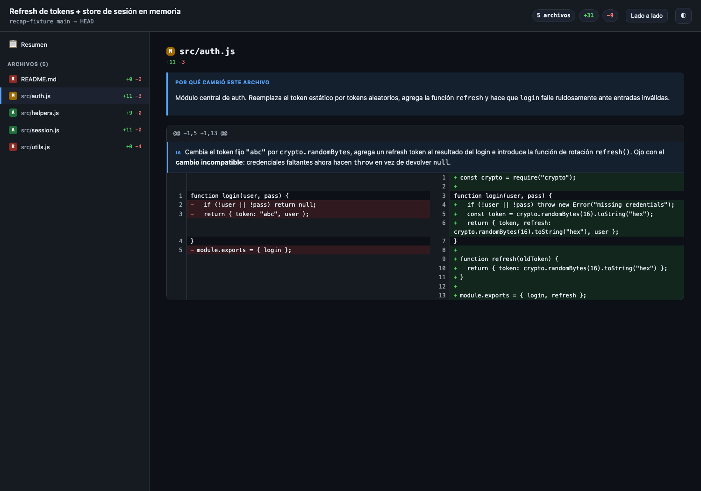
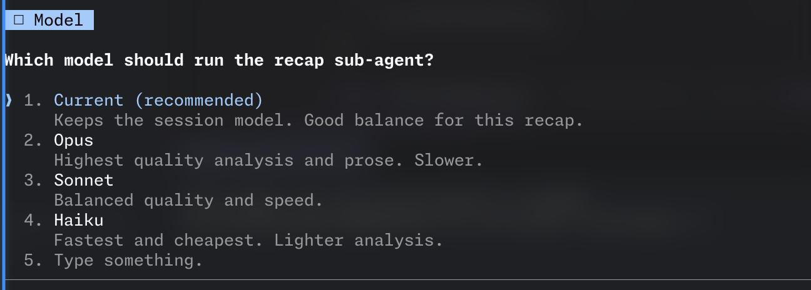

# diff-recap

Turn any git diff into a **single self-contained, fully-local** interactive
recap: architecture diagram, annotated side-by-side diffs, and per-file /
per-hunk AI explanations of **why** the code changed. No external service, no
server, no CDN — the output is one `recap.html` that opens offline via
`file://`.

## Demo

Overview — exhaustive summary, architecture diagram, commits, changed-file grid:


Per-file detail — the AI "why this file changed" note and per-hunk explanations
above a side-by-side diff:



It also localizes to the language you talk to the agent in, and asks which model
to run with before delegating the work to a sub-agent:



## Why

`visual-recap` (and even its "local-files mode") still depends on the
`@agent-native/core` package and the hosted Plan UI reading through a localhost
bridge — your code shape leaves the machine and the viewer is not yours.
`diff-recap` produces one HTML file that contains everything (viewer + Mermaid
engine + data) and opens in any browser, offline.

Design highlights:

- **Facts vs. prose are separated.** The diff, paths, and lines are extracted
  mechanically from git (true by construction); the AI only writes the "why".
- **Zero runtime dependencies.** Pure Node + git. No `npm install`.
- **Self-contained output.** ~3 MB HTML (mostly the inlined Mermaid engine).

## How it works

```
1. scripts/collect.mjs   git range  ──▶  recap-data.json   (facts, true by construction)
2. the sub-agent authors analysis   ──▶  analysis.json     (summary, diagram, WHY per file/hunk)
3. scripts/generate.mjs  merge       ──▶  recap.html        (one self-contained file)
```

Everything for a recap lands together in `<repo-root>/.recap/<branch>/`.

## Install

It is a Claude Code (and compatible) Agent Skill. Clone it into your skills
directory:

```bash
# personal skill — available everywhere
git clone git@github.com:cocodrino/diff-recap.git ~/.claude/skills/diff-recap

# or as a project skill — travels with one repo
git clone git@github.com:cocodrino/diff-recap.git .claude/skills/diff-recap
```

Restart the agent so it picks up the skill, then run `/diff-recap` inside the
repo you want to recap.

## Manual usage (without the skill runner)

```bash
# inside the repo you want to recap
node /path/to/diff-recap/scripts/collect.mjs --base main --head HEAD
# ...author .recap/<branch>/analysis.json (see SKILL.md for the schema)...
node /path/to/diff-recap/scripts/generate.mjs --open
```

## Layout

- `SKILL.md` — agent instructions (the entry point when invoked as a skill).
- `scripts/collect.mjs` — extracts the diff into deterministic `recap-data.json`.
- `scripts/generate.mjs` — inlines the viewer + Mermaid + data into `recap.html`.
- `scripts/paths.mjs` — resolves the per-branch `.recap/<branch>/` output dir.
- `assets/viewer.css`, `assets/viewer.js` — the embedded viewer (vanilla, no deps, i18n).
- `assets/mermaid.min.js` — vendored Mermaid for offline diagram rendering.

## Requirements

Node.js and `git`. Run inside a git repository.
