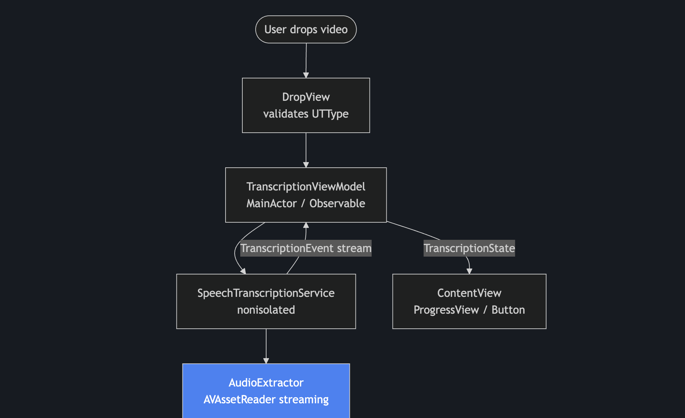
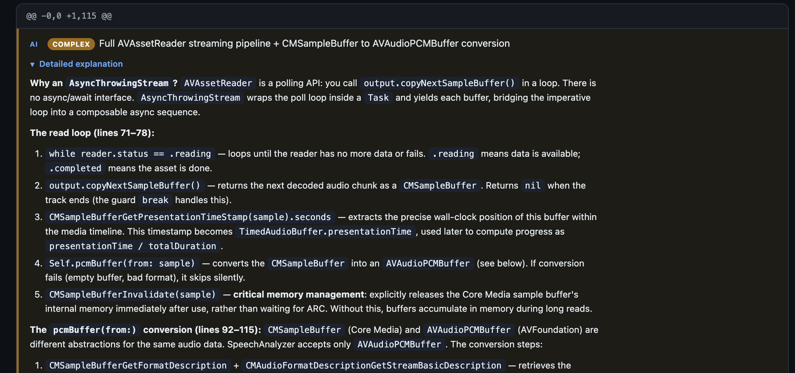
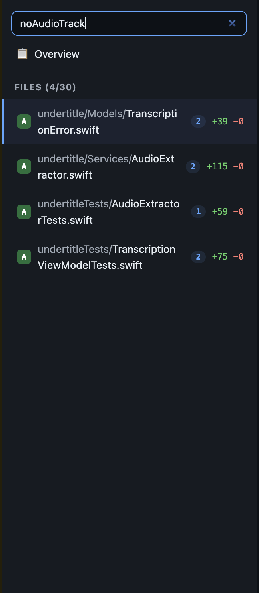
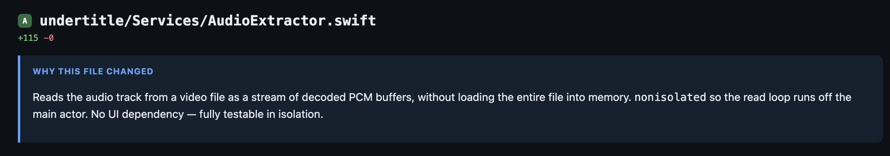
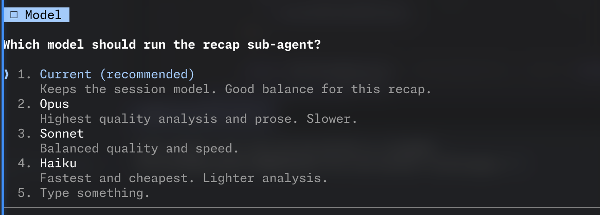
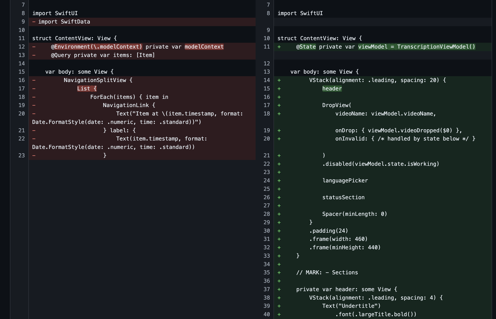
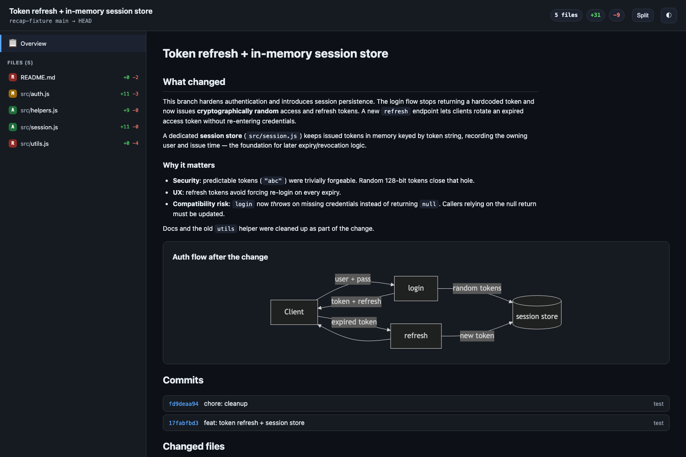

# 📊 diff-recap

**Understand any code change at a glance — fully offline.**

`diff-recap` turns a git diff into one self-contained, interactive `recap.html`:
architecture diagrams, side-by-side diffs, and AI explanations of *why* the code
changed. No external service, no server, no sign-in — just open the file in your
browser. Even on a plane. ✈️

> 💡 **Heads up:** it reads a **git diff**, so your changes need to be tracked by
> git (committed, or staged/modified on already-tracked files). Brand-new files
> you have never `git add`ed won't show up — stage them first.

---

## ✨ What you get

### 1. 🗺️ Diagrams that explain the change

Each recap includes a Mermaid **architecture** diagram *and* a **code-flow**
diagram that traces how execution moves through the change — step by step,
anchored to real `file:line` locations (e.g. `buildUrls() generate_url.ts:20` →
`fetchPage() fetch_api.ts:45` → …) — so you grasp the shape of the change
*before* reading a single line.



### 2. 🧠 AI explanations for complex logic blocks

diff-recap detects hard-to-follow code, flags it with a **Complex** badge, and
gives you an expandable, step-by-step AI walkthrough of exactly what the block
does and why it works — so dense logic stops being a wall of text.



### 3. 🔍 Search across files and code

Type a keyword and the sidebar instantly filters files by path **and** by diff
content, showing how many matches each file has.



### 4. 📝 A plain-English summary per file

Every changed file tells you what it does and why it changed — no guessing.



### 5. 🎛️ Choose the model that runs it

Before building the recap, diff-recap asks which model should do the work —
keep your current one, or pick Opus / Sonnet / Haiku to trade quality for speed.



### 6. 🧭 Decisions made — who chose what, and why

The diff shows *what* changed; it can't show which alternatives were on the
table. With the companion skill **`diff-recap-choices`**, the agent logs every
decision the moment it closes — the options weighed, the one chosen, the reason,
and whether **you** or **the agent** decided — in
`.recap/choices/<branch>.md`. That file is committed, so it travels in the PR,
and the recap shows it as a **Decisions made** block.

### …and the rest

A full overview (summary + diagrams + decisions + commits), a **file tree
sidebar** like a GitHub review (fixed, resizable, hideable; tests toned down),
**hover any file mention to find it in the tree**, **pan & zoom** on diagrams,
**word-level diff highlighting** (only the tokens that actually changed light
up), split/unified toggle, light/dark theme, English & Spanish UI, and shareable
deep links (`recap.html#file/2`) that work with the browser's Back button.





---

## 🚀 Install (30 seconds)

It's a Claude Code (and compatible) Agent Skill — no `npm install`, no build.

This repo holds **two skills**:

| Skill | What it does |
|---|---|
| `diff-recap` | Builds the recap (`/diff-recap`). |
| `diff-recap-choices` | Logs decisions while you work, for the recap's **Decisions made** block. |

```bash
# 1. diff-recap — available everywhere
git clone git@github.com:cocodrino/diff-recap.git ~/.claude/skills/diff-recap

# 2. diff-recap-choices — lives inside the same clone; agents only discover
#    skills one level under ~/.claude/skills/, so link it there
ln -s ~/.claude/skills/diff-recap/diff-recap-choices ~/.claude/skills/diff-recap-choices
```

Restart your agent, then run `/diff-recap` inside any git repo. It asks which
model to use, then builds the recap for you.

Prefer it scoped to one project? Clone into `<project>/.claude/skills/diff-recap`
and link `<project>/.claude/skills/diff-recap-choices` the same way.

### Make the decision log work

**a) Let git commit the log.** Recaps are generated files and should be ignored,
but the decision logs must be committed. Git can't re-include a file inside an
ignored folder, so ignore the folder's *contents*:

```gitignore
.recap/*
!.recap/choices/
```

**b) Make the agent log decisions on its own.** A skill only loads when the
agent thinks a task matches it, and "we just decided something" happens in the
middle of other work. Add one always-on line to your `~/.claude/CLAUDE.md` (or
the project's) so it never forgets:

```markdown
- When a choice between real alternatives closes on a branch (I pick an option
  you offered, or you pick one yourself), log it right away with the
  `diff-recap-choices` skill before moving on.
```

Check a log any time with `node ~/.claude/skills/diff-recap/scripts/decisions.mjs`
(prints the current branch's log path and validates it).

---

## 🤔 Why diff-recap?

Most diff viewers either need a server, a hosted account, or send your code
somewhere else to render it. `diff-recap` is the opposite: **one HTML file with
everything inside** (viewer + diagram engine + data), opening in any browser,
offline.

- 🔒 **Private** — nothing leaves your machine.
- 🪶 **Zero dependencies** — pure Node + git.
- 📦 **Self-contained** — a single ~3 MB HTML you can email or archive.
- ✅ **Trustworthy** — the diff and lines come straight from git; the AI only
  writes the explanations.

---

## 🛠️ How it works

```
1. collect.mjs   git diff   ──▶  recap-data.json   (the facts, straight from git)
2. the AI writes analysis   ──▶  analysis.json     (summary, diagram, the "why")
3. generate.mjs  merge       ──▶  recap.html        (one self-contained file)
```

Everything lands together in `<repo-root>/.recap/<branch>/`. The decision log,
if any, is read from `<repo-root>/.recap/choices/<branch>.md`.

### Manual usage (without the skill)

```bash
# inside the repo you want to recap (changes must be committed/tracked)
node /path/to/diff-recap/scripts/collect.mjs --base main --head HEAD
# ...author .recap/<branch>/analysis.json (schema is in SKILL.md)...
node /path/to/diff-recap/scripts/generate.mjs --open
```

---

## 📋 Requirements

Node.js and `git`. Run it inside a git repository — that's it.
